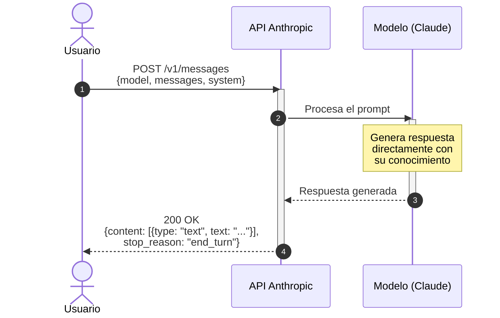
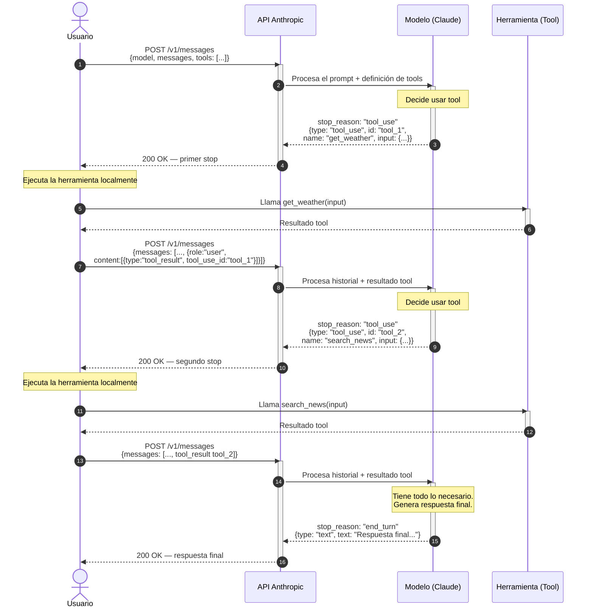

# Clase Siete - 12 de Marzo del 2026

# Repaso

* VoiceAI
  * Fundamentos y usos
  * TTS (Text to Speech)
    * Javascript - SpeechSynthesis
    * Liberia Python - gTTs
    * Modelos OS - Ejecutado con el Framrwork CoquiTTS - TTS (No me funciono en Colab)
    * Api Key - Hicimos un ejemplo en Groq
    * Proveedores Cloud - Azure, Google Vertex
    * Api premium como ElevenLabs
  * STT (Speech to Text)
    * Javascript - SpeechRecognizer
    * Libreria Python - speechRecognizer
    * Modelos OS - Como VibeVoice (Mas reciente de MS) - https://huggingface.co/microsoft/VibeVoice-ASR
    * Api Key - Hicimos un ejemplo en Groq
    * Proveedores Cloud - Azure
* Un google Colab que maneje STT
* Criterio cuando conviene elegir cada uno

# Colab de la clase

> https://colab.research.google.com/drive/1ZCyfPm8KMAfBzuUKcX8CJMgkRtV_ImdB?usp=sharing

# Ejemplo que quedo pendiente de la clase

```python
import gradio as gr
import speech_recognition as sr
from pydub import AudioSegment
import os


def procesar_request(audio_usuario):
    try:
      reconocedor = sr.Recognizer()

      mi_archivo = AudioSegment.from_file(audio_usuario)
      mi_archivo.export("/tmp/temp.wav", format="wav")
      
      with sr.AudioFile("/tmp/temp.wav") as fuente:
        audio = reconocedor.record(fuente)

      texto = reconocedor.recognize_google(audio, language="es-ES")
    except  Exception as e:
        texto = e

    # Opcional: borrar archivo temporal
    #if audio_usuario != audio_wav:
    #    os.remove(audio_wav)

    return texto


iface = gr.Interface(
    fn=procesar_request,
    inputs=[
        gr.Audio(label="Habla con el agente", type="filepath"),
    ],
    outputs=[
        gr.Textbox(label="El usuario Dijo"),
    ]
)

iface.launch()
```

# Integracion de un RAG con un LLM

```python
import gradio as gr
from sentence_transformers import SentenceTransformer, util
from openai import OpenAI

modelo_embedings = SentenceTransformer('sentence-transformers/all-MiniLM-L6-v2')

documentos = [
    "Python es un lenguaje de programación de alto nivel.",
    "Donald Trump se proclama dictador de USA",
    "Los animales migran en masa al polo sur para escapar de los humanos"
]

embeddings_documentos = modelo_embedings.encode(documentos, convert_to_tensor=True)

def recuperar_documento_relacionado(query):
    try:
      query_embedding = modelo_embedings.encode(query, convert_to_tensor=True)

      cos_scores = util.cos_sim(query_embedding, embeddings_documentos)[0]

      indice_mas_similar = cos_scores.topk(1).indices

      return documentos[indice_mas_similar]
    except  Exception as e:
        return e


def procesar_prompt(api_key, prompt):
  try:
    contexto = recuperar_documento_relacionado(prompt)
    
    client = OpenAI(
      api_key=api_key,
      base_url="https://api.groq.com/openai/v1",
    )

    respuesta = client.chat.completions.create(
        messages = [
            {
                "role": "system",
                "content": f"""
                  Eres un agente que responde en ingles. 
                  En base a lo que dice el usuario debes hablar sobre
                  {contexto}
                """
            },
            {
                "role": "user",
                "content": prompt
            }
        ],
        model="openai/gpt-oss-20b"
    )

    return respuesta.choices[0].message.content

  except Exception as e:
    return e


intf = gr.Interface(
    fn = procesar_prompt,
    inputs = [
        gr.Textbox(label="API Key", type="password"),
        gr.Textbox(label="Prompt")
    ],
    outputs = "text",
    title = "Rag con LLM"
)

intf.launch()
```

## Integracion de RAG Con LLM con API de Gemini (google)

* Justo me llego hace nos dias un mail promocionando los embedings de google : https://ai.google.dev/gemini-api/docs/embeddings?hl=es-419
* Sacar una api key de Gemini en : https://aistudio.google.com/api-keys

```python
import gradio as gr
from google import genai
from google.genai import types
from sklearn.metrics.pairwise import cosine_similarity
from openai import OpenAI
import numpy as np

# ── Documentos base ──────────────────────────────────────────────────────────
documentos = [
    "Python es un lenguaje de programación de alto nivel.",
    "Donald Trump se proclama dictador de USA",
    "Los animales migran en masa al polo sur para escapar de los humanos"
]

# ── Helpers de embeddings con Gemini ─────────────────────────────────────────
def obtener_embeddings(api_key_gemini: str, textos: list[str]) -> np.ndarray:
    """Devuelve una matriz (n, dim) con los embeddings de los textos."""
    client = genai.Client(api_key=api_key_gemini)
    result = client.models.embed_content(
        model="gemini-embedding-001",
        contents=textos,
        config=types.EmbedContentConfig(task_type="SEMANTIC_SIMILARITY"),
    )
    return np.array([e.values for e in result.embeddings])


def recuperar_documento_relacionado(api_key_gemini: str, query: str) -> str:
    """Recupera el documento más similar a la query usando Gemini embeddings."""
    embeddings_docs = obtener_embeddings(api_key_gemini, documentos)
    embedding_query = obtener_embeddings(api_key_gemini, [query])          # (1, dim)

    similitudes = cosine_similarity(embedding_query, embeddings_docs)[0]   # (n,)
    indice_mas_similar = int(np.argmax(similitudes))

    return documentos[indice_mas_similar]


# ── Pipeline RAG ─────────────────────────────────────────────────────────────
def procesar_prompt(api_key_groq: str, api_key_gemini: str, prompt: str) -> str:
    try:
        # 1. Recuperar contexto relevante con Gemini
        contexto = recuperar_documento_relacionado(api_key_gemini, prompt)

        # 2. Generar respuesta con Groq
        client = OpenAI(
            api_key=api_key_groq,
            base_url="https://api.groq.com/openai/v1",
        )

        respuesta = client.chat.completions.create(
            messages=[
                {
                    "role": "system",
                    "content": (
                        "Eres un agente que responde en inglés. "
                        "En base a lo que dice el usuario debes hablar sobre: "
                        f"{contexto}"
                    ),
                },
                {"role": "user", "content": prompt},
            ],
            model="openai/gpt-oss-20b",   # modelo disponible en Groq
        )

        return respuesta.choices[0].message.content

    except Exception as e:
        return f"Error: {e}"


# ── Interfaz Gradio ───────────────────────────────────────────────────────────
intf = gr.Interface(
    fn=procesar_prompt,
    inputs=[
        gr.Textbox(label="API Key de Groq",   type="password"),
        gr.Textbox(label="API Key de Gemini", type="password"),
        gr.Textbox(label="Prompt"),
    ],
    outputs="text",
    title="RAG con Gemini Embeddings + Groq LLM",
    description=(
        "Ingresa tus claves y un prompt. "
        "Se usará Gemini para encontrar el documento más relevante "
        "y Groq para generar la respuesta."
    ),
)

intf.launch()
```

* Para armar este codigo me ayudo Claude
  * https://claude.ai/share/4560ae43-b570-461d-8462-fbbe3e1cca9a

# Tools 

* Hasta ahora los LLM no tienen la capacidad de accion. Este es como funcion hasta ahora



* Algunos modelos soportan Tool Calling


